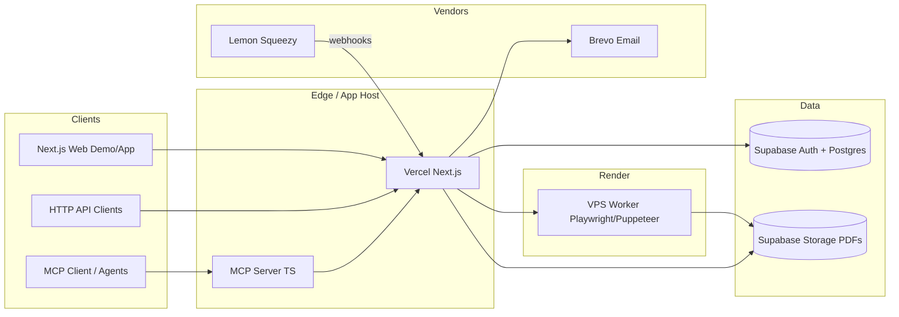

# 04 — Tech

**Stack:** Next.js (App Router) · TypeScript · Supabase · VPS Playwright/Puppeteer · Brevo · Lemon Squeezy · MCP (`create_branded_pdf`)

---

## Architecture



ASCII fallback:

```
[Browser] ──► [Next.js / Vercel] ──► [Supabase Auth/DB/Storage]
                      │
                      ├──► [VPS: Chromium PDF render]
                      ├──► [Brevo]
                      └──◄ [Lemon Squeezy webhooks]

[MCP Client] ──► [MCP TS server] ──► [same Next.js API]
```

**One render path:** `createRenderJob(content, brandKit) → HTML template → Chromium PDF → Storage → url`.

---

## Data model (Postgres / Supabase)

### `profiles`
| Column | Type | Notes |
|--------|------|-------|
| `id` | uuid PK | = auth.users.id |
| `email` | text | |
| `plan` | enum | `free` \| `pro` \| `founding` |
| `founding_variant` | enum null | `year` \| `lifetime` |
| `ls_customer_id` | text null | |
| `api_key_hash` | text null | store hash only |
| `created_at` | timestamptz | |

### `brand_kits`
| Column | Type | Notes |
|--------|------|-------|
| `id` | uuid PK | |
| `user_id` | uuid FK | |
| `name` | text | |
| `logo_path` | text null | storage |
| `primary_color` | text | hex |
| `secondary_color` | text null | |
| `font_heading` | text | |
| `font_body` | text | |
| `footer_text` | text null | |
| `website` | text null | |
| `accent_style` | text | minimal\|bar\|left-rule |
| `created_at` / `updated_at` | timestamptz | |

### `renders`
| Column | Type | Notes |
|--------|------|-------|
| `id` | uuid PK | |
| `user_id` | uuid null | null = anonymous demo |
| `brand_kit_id` | uuid null | |
| `status` | enum | queued\|processing\|done\|failed |
| `input_chars` | int | |
| `pdf_path` | text null | |
| `share_id` | text unique null | |
| `share_expires_at` | timestamptz null | |
| `error` | text null | |
| `created_at` | timestamptz | |

### `usage_daily`
| Column | Type | Notes |
|--------|------|-------|
| `user_id` / `anon_key` | text | |
| `day` | date | |
| `pdf_count` | int | |

### `founding_meta` (singleton or config)
| Column | Type | Notes |
|--------|------|-------|
| `seats_sold` | int | max 50 |
| `seats_cap` | int | 50 |

RLS: users read/write own kits & renders; service role for workers/webhooks.

---

## API contract

Base: `https://api.dynamogic.com` or same-origin `/api`.

### `POST /api/v1/pdfs`
**Auth:** Bearer API key or session cookie (web).

```json
{
  "content": "# Markdown...",
  "content_type": "markdown",
  "brand_kit_id": "uuid-optional",
  "brand": {
    "name": "Acme",
    "primary_color": "#0A0A0A",
    "font_heading": "Inter",
    "font_body": "Inter",
    "accent_style": "bar",
    "footer_text": "Acme Inc.",
    "website": "https://acme.example",
    "logo_url": "https://..."
  },
  "share": true
}
```

**Response 201:**
```json
{
  "id": "uuid",
  "status": "done",
  "pdf_url": "https://...",
  "share_url": "https://dynamogic.com/s/abc",
  "chars": 1234
}
```

**Errors:** `401` invalid key · `402`/`429` quota · `400` validation · `500` render failure.

### `GET /api/v1/pdfs/:id`
Metadata + URLs if owned.

### `GET /s/:shareId`
Public PDF or viewer; respect expiry.

### Webhooks
`POST /api/webhooks/lemon-squeezy` — verify signature; update `plan` / founding seats.

---

## MCP spec

- **Server:** TypeScript MCP SDK  
- **Tools:** exactly one — `create_branded_pdf`  
- **Description & schema:** `content/mcp-tool-description.md`  
- **Implementation:** HTTP call to `POST /api/v1/pdfs` with user’s API key from env `DYNAMOGIC_API_KEY`  
- **Transport:** stdio (local) and/or hosted SSE later; v1 ship stdio package on npm  

---

## Security

- Hash API keys (sha256 + pepper); show once at creation  
- Verify Lemon Squeezy webhook signatures  
- Rate limit by user id + IP for anonymous demo  
- SSRF: do not fetch arbitrary user HTML remote assets without allowlist; sanitize markdown  
- Chromium: no `--no-sandbox` debate on shared hosts without container isolation; run worker as locked-down user  
- Secrets only in env / Vercel / VPS secret store  
- CORS: restrict API to known origins for browser; keys for server/MCP  

---

## Env vars

```bash
# App
NEXT_PUBLIC_APP_URL=
NEXT_PUBLIC_SUPABASE_URL=
NEXT_PUBLIC_SUPABASE_ANON_KEY=
SUPABASE_SERVICE_ROLE_KEY=

# Render worker
RENDER_WORKER_URL=
RENDER_WORKER_SECRET=

# Brevo
BREVO_API_KEY=
BREVO_SENDER_EMAIL=
BREVO_SENDER_NAME=Dynamogic

# Lemon Squeezy
LEMONSQUEEZY_API_KEY=
LEMONSQUEEZY_STORE_ID=
LEMONSQUEEZY_WEBHOOK_SECRET=
LEMONSQUEEZY_VARIANT_PRO_MONTHLY=
LEMONSQUEEZY_VARIANT_PRO_YEARLY=
LEMONSQUEEZY_VARIANT_FOUNDING_YEAR=
LEMONSQUEEZY_VARIANT_FOUNDING_LIFETIME=

# OAuth (Supabase Google)
# configured in Supabase dashboard + Google Cloud

# Analytics
NEXT_PUBLIC_PLAUSIBLE_DOMAIN=
# or NEXT_PUBLIC_UMAMI_WEBSITE_ID= / UMAMI_URL=

# Security
API_KEY_PEPPER=
```

---

## Deploy topology

| Piece | Where | Notes |
|-------|-------|-------|
| Next.js app | Vercel | Preview + prod |
| DB/Auth/Storage | Supabase | Project region close to users |
| PDF worker | VPS (Hetzner/DO) | Docker with Playwright/Puppeteer; auth via shared secret |
| MCP package | npm `@mtaqys/dynamogic-mcp` (name TBD) | stdio |
| DNS | Domain registrar → Vercel | `www` + apex; optional `api` |
| Email DNS | Brevo DKIM/SPF | |
| Monitoring | UptimeRobot | Hit `/api/health` + worker health |

**Budget fit:** Keep VPS small (shared Chromium queue, concurrency 1–2); Vercel hobby/pro as needed; Supabase free→pro when required; Brevo free tier first.

---

## Health

- `GET /api/health` → `{ ok: true, version }`  
- Worker `GET /health` → Chromium reachable  

---

## Testing notes

- Unit: markdown → HTML sanitization  
- Integration: quota enforcement  
- E2E: demo generate happy path  
- Webhook: signed fixture for Lemon Squeezy  
